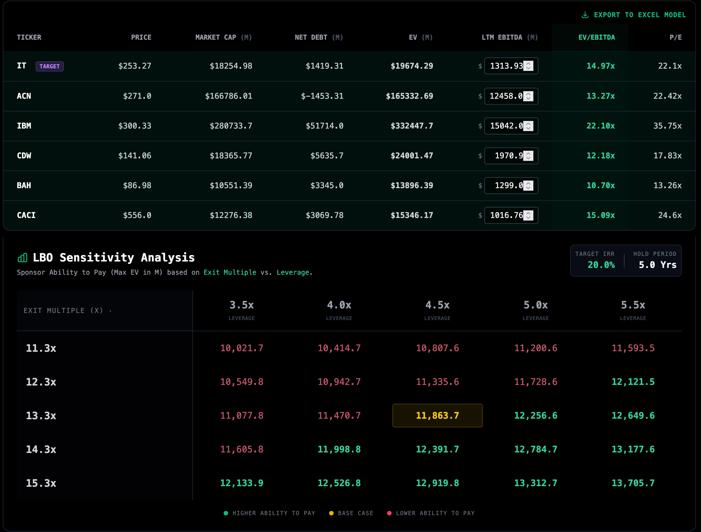
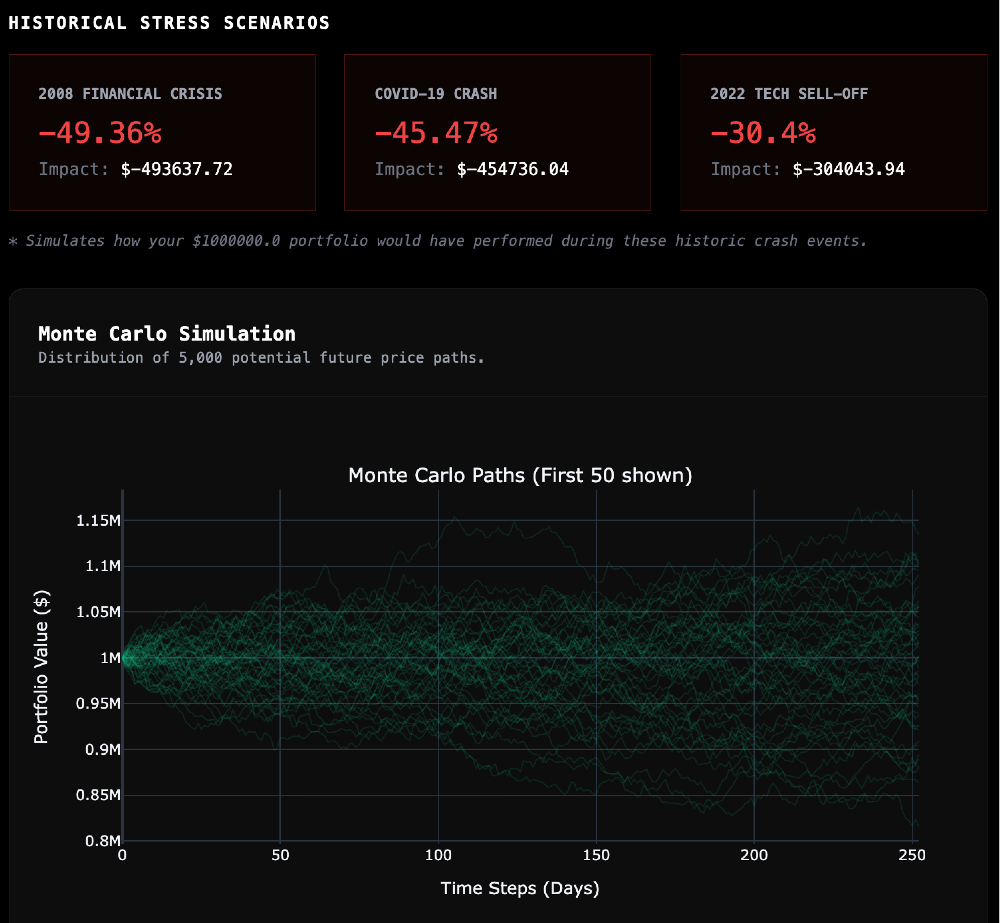

# Financial Engineering & Institutional Valuation Workbench

> **⚠️ Note on Proprietary Source Code:** > The core logic for this platform (including the Reverse-LBO solver and Excel generation engine) is proprietary. This repository serves as a technical documentation hub and architectural overview. **Full source code access is available for audit upon request.**

**Live Demo:** [www.harshit-portfolio.me](https://www.harshit-portfolio.me)

---

## System Architecture Overview
This platform is built on a **Hybrid Computational Engine** designed to solve the "Garbage In, Garbage Out" problem of public financial data. It bridges the gap between raw market data and the manual "Adjusted" reality of institutional deal-making.

*Figure 1: High-level architectural data flow from raw API ingestion to automated Excel model generation.*

### Key Architectural Features:
* **Parallel Fetching Engine:** Implements `concurrent.futures.ThreadPoolExecutor` to execute asynchronous requests to market data providers, reducing peer-group data latency by ~85%.
* **Stateful Manual Overrides:** A custom JavaScript engine allows analysts to override LTM EBITDA and Net Debt in real-time. The UI instantly recalculates the entire valuation bridge and LBO floor without a page refresh.
* **Audit-Ready Excel Export:** Built with `XlsxWriter`, the tool generates professional models that use **live Excel formulas** (e.g., `=EV/EBITDA`) and follow the standard Blue/Black investment banking formatting convention.

---

## Proprietary Toolset

### 1. Leveraged Buyout (LBO) & Valuation Engine
**The Problem:** Most student models are forward-looking.
**The Solution:** This engine solves for the **Sponsor Floor** (Max Entry Price) required to hit a specific IRR target (e.g., 20%) given leverage constraints.

*Figure 2: The LBO Dashboard showing the Peer Comps Bridge (Top) and the 5x5 Sponsor Floor Sensitivity Matrix (Bottom).*

* **Reverse LBO Logic:** Back-solves for "Ability to Pay" based on exit multiples and leverage tranches.
* **Comps Bridging:** Automates the reconciliation of Equity Value to Enterprise Value, handling cross-currency adjustments (USD/INR/EUR) instantly.
* **Sensitivity Matrix:** Generates a real-time heatmap of Implied Max Entry EV, allowing for rapid "Go/No-Go" deal screening.

### 2. Quantitative Risk Estimator (VaR)
**The Problem:** Standard deviation assumes normal distribution, failing to capture tail risk.
**The Solution:** A stochastic engine that models non-linear downside risk.

*Figure 3: Monte Carlo Simulation (first 50 paths) visualizing tail-risk distribution and Value at Risk (VaR) thresholds.*

* **Stochastic Modeling:** Projects 5,000+ price paths via Monte Carlo simulations to visualize potential future asset performance.
* **Tail Risk Metrics:** Calculates **Value at Risk (VaR)** and **Expected Shortfall (CVaR)** at 95% and 99% confidence intervals to stress-test portfolios against "Black Swan" events.

### 3. Options Analytics Lab (Derivatives)
A dedicated workbench for pricing and visualizing second-order risks in derivatives portfolios.

*Figure 4: Black-Scholes Derivatives Lab showing real-time Greeks sensitivity.*

* **BSM Pricing:** Full implementation of the Black-Scholes-Merton model for European options.
* **Greeks Visualizer:** Real-time heatmap visualization of **Delta, Gamma, Theta, and Vega**, allowing traders to assess sensitivity to time decay and volatility shifts.

### 4. NSE Portfolio Optimizer
* **Modern Portfolio Theory (MPT):** Utilizes Mean-Variance Optimization and Hierarchical Risk Parity (HRP) to construct efficient frontiers.
* **Bayesian Shifting:** Includes a "User Views" feature that allows analysts to shift historical return distributions to match subjective future expectations (Black-Litterman framework).

*Figure 5: Visualizing the Efficient Frontier by plotting Expected Return vs. Risk (Volatility) for 3,000 simulated portfolios.*
---

## Tech Stack
* **Backend:** Python (Flask), `concurrent.futures`, `yfinance`
* **Computational:** `Pandas`, `NumPy`, `skfolio`, `SciPy` (Optimization & Stats)
* **Data Visualization:** `Plotly.js` (Interactive Financial Charts)
* **Model Export:** `XlsxWriter` (Automated Excel Engineering)
* **Frontend:** Tailwind CSS, Vanilla JavaScript (Async/Await Data Lifecycle)

---

## Contact & Professional Inquiries
**Harshit Singh** *Fresh Graduate | Aspiring Investment Professional* [LinkedIn](https://linkedin.com/in/harshit-singh-502246214/) | [Email](mailto:harshitsingh4907@gmail.com)
